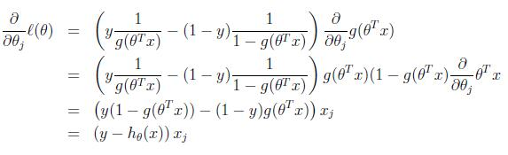
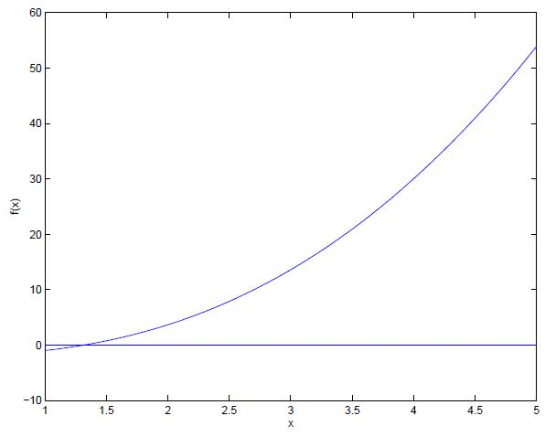
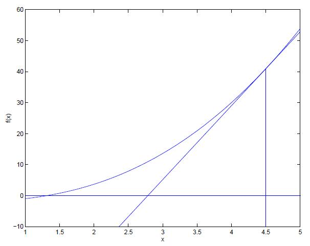
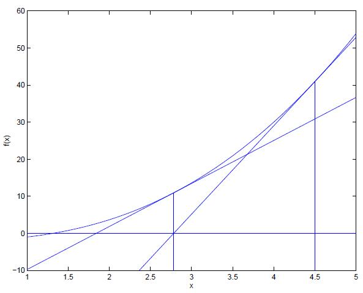

原文：http://cs229.stanford.edu/notes/cs229-notes1.pdf  
翻译：[MIL Learning Group](https://github.com/milLearningGroup/Stanford-CS229-CN) - [AcceptedDoge](https://github.com/AcceptedDoge)

## Part II 分类与逻辑回归（Classification and logistic regression）

现在让我们来讨论一下分类问题。这和回归问题很类似，不过我们现在想要预测的 $y$ 值是数量很少的一些离散值。首先，我们把目光放在 **二分类（binary classification）** 问题上，也即是说 $y$ 只有两种取值可能，0 或者 1 。（而我们提到的分类问题大多数时候是推广到多类别情形下的。）例如，如果我们想要建立一个垃圾邮件分类器，那么 $x^{(i)}$ 可能是一封邮件的某些特征，$y$ 为1则表示这是一封垃圾邮件，为0则表示不是。在这里，0也被称为 **负类（negative class）** ，1也被称为 **正类（postive class）** ，他们有时候也会用符号 “+” 和 “-” 来定义。给定 $x^{(i)}$ ，则对应的 $y^{(i)}$ 也被称作这个训练样本的 **标签（label）** 。

### 5 Logistic 回归（Logistic regression）

>  注：Logistic 回归的中文译法当前主要有“逻辑回归”和“逻辑斯蒂回归”两种，这里保留了英文原名，希望大家能够认出。

我们可以通过忽略 $y$ 是一个离散值从而解决分类问题，也即是使用原始的线性回归算法尝试在给定 $x$ 的情况下预测 $y$ 。然而，很容易用例子证明这样的方法是不靠谱的。从直觉上看，当我们知道 $y\in\{0,1\}$ 时，预测值 $h_\theta(x)$ 如果超过 1 或者小于 0 ，也就没有了意义。  

为了满足我们的需求，我们将改变假设 $h_\theta(x)$ 的形式，选择下面的函数：  

$$ h_\theta(x)=g(\theta^Tx)=\frac {1}{1+e^{-\theta^Tx}}$$

其中 $g(z)=\frac {1}{1+e^{-z}}$ 被称为 **logistic 函数（logistic function）** ，此处使用的也被叫作 **sigmoid 函数（sigmoid function）** ，下面是图示：  

注意到当 $z\rightarrow \infty$ 时，$g(z)$ 趋近于 1， $z\rightarrow -\infty$ 时，$g(z)$ 趋近于 0 ，因此也表明了 $h(x)$ 总是位于 0 和 1 之间。和之前一样，我们约定了特征 $x_o=1$ ，因此有 $\theta^Tx=\theta_0+\sum^n_{j=1}\theta_j x_j$ 。

从现在开始，我们把 $g$ 当作是给定的函数了。其它能够从0到1之间光滑递增的函数也可以被使用，但是这其中有一些原因我们以后会讲到（当讲到广义线性模型GLMs和生成学习算法时），logistic 函数的选择是十分合理自然的。在继续我们的下一个话题前，这里有一个关于 sigmoid 函数导数的重要推导，我们写作 $g'$ :    
$$
\begin{equation}\begin{split} 
g'(x) &= \frac{d}{dz}\frac {1}{1+e^{-z}} \\
        &=\frac {1}{(1+e^{-z})^2} (e^{-z})  \\
        &= \frac {1}{(1+e^{-z})}  (1-\frac {1}{(1+e^{-z})} ) \\
        &= g(z) (1-g(z))
 \end{split}\end{equation}
$$

那么，在给定了 logistic 回归模型后，我们如何根据它来拟合 $\theta$ 呢？我们之前已经讲过了，在一系列假设的前提下，如何使用极大似然估计来推导出最小二乘回归。让我们赋予我们的分类模型一系列的概率假设，接着通过极大似然来拟合参数：  

让我们假设：  

$$ P(y=1\mid x;\theta) = h_\theta(x) $$

$$ P(y=0\mid x;\theta) = 1-h_\theta(x) $$

注意，上面的式子可以改写成一个更加简洁的形式：  

$$p(y\mid x;\theta)=(h_\theta(x))^y(1-h_\theta(x))^{1-y}$$

假定给定的 $m$ 个样本之间都是相互独立的，我们可以这样写参数的似然函数：  

$$
\begin{equation}\begin{split}
L(\theta) & = p(\overset{\rightarrow}{y} \mid X;\theta) \\ 
&= \prod_{i=1}^{m} p(y^{(i)}\mid x^{(i)};\theta) \\ 
&=  \prod_{i=1}^{m}  (h_\theta(x^{(i)}))^{y^{(i)}}(1-h_\theta(x^{(i)}))^{1-y^{(i)} }
\end{split}\end{equation}
$$

与前面线性回归章节的做法一样，采用最大化对数似然的形式会简单一些：  
$$
\begin{equation}\begin{split}
\cal {l} (\theta)& = \log  L  (\theta) \\
& = \sum_{i=1}^m y^{(i)}\log h(x^{(i)})+(1-y^{(i)})\log (1-h(x^{(i)})) 
\end{split}\end{equation}
$$
我们要如何去最大化这个似然函数呢？和线性回归章节中的求导方法类似，我们可以使用梯度上升。用向量化的符号来写，我们的更新步骤将会表示成： $ \theta:=\theta+\alpha \nabla_\theta \cal l (\theta) $ . （注意，我们现在是在最大化而不是最小化这个函数，所以更新的公式中由负号变成了正号。）同样地还是从只有一个训练样本 $ (x,y) $ 的情况开始，求导推出梯度上升的规则：  

在上面的推导过程中，我们使用到了 $ g'(z) = g(z) (1-g(z)) $ ，最终的随机梯度上升规则为：  

$ \theta_j:=\theta_j+\alpha(y^{(i)}-h_\theta(x^{(i)}))x_j^{(i)} $

如果拿上面的公式与LMS更新规则进行比较，我们会发现看起来居然完全一样；但是他们**并不是**一样的算法，因为 $h_\theta(x^{(i)})$ 现在被定义为关于 $\theta^Tx^{(i)}$ 的一个非线性函数。尽管如此，我们在面对不同的算法和学习问题的时候，最终却得到了同样的更新规则，这实在让人有点惊讶。这是一种巧合，还是有着更深层次的原因呢？当我们学习到GLM章节的时候，我们将一起来回答这一问题。

### 6 题外话：感知器学习算法（Digression: The perceptron learning algorithm）

现在，让我们简要地谈论一个历史上曾经令人很感兴趣的算法，当学习到学习理论章节的时候我们将还会提到这个。试想一下修改logistic回归的方法，来“迫使”它能够输出除了0或1亦或是其它以外的输出值。为了达到这个目的，自然而然地会想到去改变阈值函数 $g$ 的定义：  
$$
g(z) = 
\begin{cases}
1 , & \text {if z} \geq {0} \\
0 , & \text {if z} < {0} \\
\end{cases}
$$
接下来，如果我们和前面一样令 $h_\theta(x)=g(\theta^Tx)$ ，但却使用修改了定义的函数 $g$ ，如果我们使用的是这个更新规则：  

$ \theta_j:=\theta_j+\alpha(y^{(i)}-h_\theta(x^{(i)}))x_j^{(i)} $ 

这样我们就得到了感知器学习算法。  

在 19世纪60 年代，这个“感知器（perceptron）”被认为是对大脑中单个神经元工作方法的一个粗略建模。考虑到这个算法比较简单，我们后续在本课程中讲学习理论的时候也会作为分析的起点来讲一讲。但一定要注意，虽然这个感知器学习算法可能看上去表面上跟我们之前讲的其他算法挺相似，但实际上这是一个和logistic回归以及最小二乘线性回归等算法在种类上都完全不同的算法；尤其重要的是，很难去对感知器的预测赋予有意义的概率解释，也很难作为一种最大似然估计算法来推导感知器学习算法。

### 7 最大化ℓ(θ)的另一个算法（Another algorithm for maximizing ℓ(θ)）

回到使用sigmoid函数作为 $g(z)$ 的 logistic回归问题，让我们讨论一种不同的最大化 $\cal l (\theta)$ 的算法。  

开始之前，我们先想一下牛顿法去求函数零点。假如我们有一些函数 $f:\mathbb R \mapsto \mathbb R$， 接着我们希望找到一个 $\theta$ ，满足 $f(\theta)=0$，其中 $\theta \in \mathbb R$ 是一个实数。牛顿法就是对 $\theta$ 进行如下的更新：  

$\theta:=\theta-\frac {f(\theta)} {f'(\theta)}$

这个方法可以很自然地进行解释，我们可以把它理解成：在当前猜测的 $\theta$ 值处用一个线性函数来对近似表示函数 $f$ ，即这条直线是 f 的切线，找到当前线性函数等于零的点，把这一个零点作为 $\theta$ 的下一次猜测值，然后依次类推。  

下面是牛顿法实际操作中的图像：  

在第一幅图中，我们看到函数 $f$ 在 $y=0$ 处画了一条直线，而我们想找到 $\theta$ 使得 $f(\theta)=0$ ；满足要求的 $\theta$ 值大概在 1.3 处。假设我们的算法初始化 $\theta=4.5$ ，根据牛顿法，在 $f$ 上$\theta=4.5$ 处作一条切线，找出计算结果为0的点，如下图所示：  

那么大概在 2.8 的位置，就是我们下一个猜测的 $\theta$ 值，然后重复步骤得到新的 $\theta $ 在1.8 处。  

在一定次数的迭代后，我们就能迅速地得到 $\theta=1.3$.  

牛顿法的给出的解决思路是让$f(\theta)=0$。如果我们想要利用它来最大化一些函数 $\cal l$ 呢？函数 $\cal l$ 的最大值的点应该对应着它的导数 $l'(\theta)$ 等于零的点。所以通过令$f(\theta)=l'(\theta)$，我们就可以同样用牛顿法来找到 $\cal l$  的最大值，然后得到下面的更新规则：

$\theta:=\theta-\frac {\cal l'(\theta)} {\cal l''(\theta)}$

（再思考一下: 如果要用牛顿法来求一个函数的最小值而不是最大值，该怎么修改？）  

最后，在咱们的logistic回归问题背景中，$\theta$ 是一个有值的向量，所以我们要对牛顿法进行扩展来适应这个情况。牛顿法进行扩展到多维情况，也叫牛顿-拉普森法（Newton-Raphson method），如下所示：

$\theta:=\theta-H^{-1}\nabla_\theta \cal l(\theta)$这里的 $\nabla_\theta \cal l(\theta)$ 和之前提过的一样，是 $\cal l(\theta)$ 关于 $\theta_i$ 的偏导数向量；$H$ 是一个 $n\times n$ 矩阵 （实际上如果包含截距项的话，应该是$n+1\times n+1$矩阵），也叫作 **Hessian** ，由下面的式子定义：  

$H_{ij}=\frac{\partial^2\cal l (\theta)}{\partial \theta_i \partial \theta_j}$

牛顿法通常都能比（批量）梯度下降法收敛得更快，而且达到最小值所需要的迭代次数也少很多。然而，牛顿法中的单次迭代往往要比梯度下降法耗费更多的性能开销，因为要查找和转换一个$n \times n$ 的 Hessian矩阵；不过只要这个 n 不是太大，牛顿法通常就还更快一些。当用牛顿法来在逻辑回归中求似然函数 $\cal l(\theta) $ 的最大值的时候，得到这一结果的方法也叫做 **Fisher scoring**. 